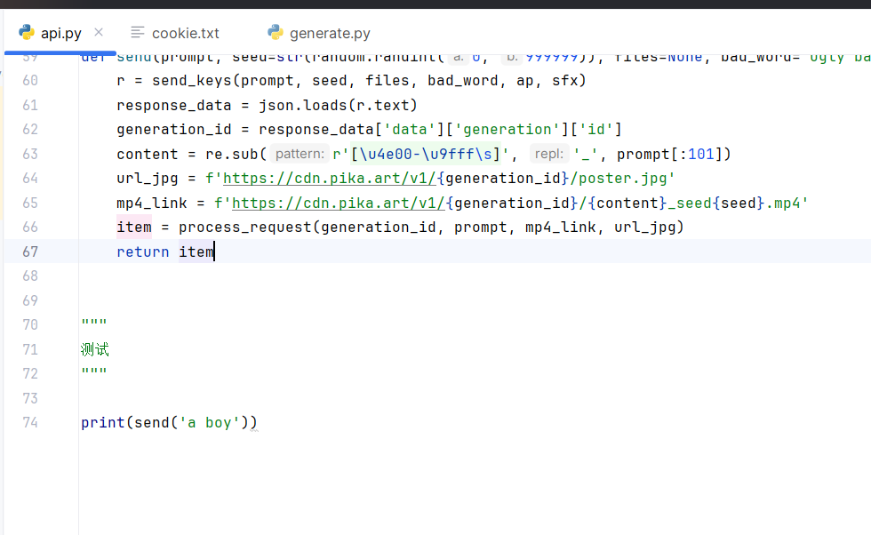

# AI接口大全

[中文](#jump1)
[English](#jump2)


## <span id="jump1">中文文档</span>


### PIKA接口

环境为python3.x，依赖版本适配python3即可

> 项目目录

```markdown
│  api.py                //对外接口，项目启动器
│  cookie.txt				    //你的账号cookie
│  generate.py				  //发送视频生成请求
│
└─static					 //下载后的视频存储
```


> 部署

- 先将本项目pika下载到本地
- 在cookie.txt填写你的账号的cookie，在
- 到api.py的测试下发送请求

 


###  ChatGPT接口

> 代写


### <span id="jump2">English Document</span>


### PIKA接口

环境为python3.x，依赖版本适配python3即可

> 项目目录

```markdown
│  api.py                    //对外接口，项目启动器
│  cookie.txt				 //你的账号cookie
│  generate.py				 //发送视频生成请求
│
└─static					 //下载后的视频存储
```


> 部署

- 先将本项目pika下载到本地

- 到api.py的测试下发送请求

###  ChatGPT接口

> 代写
> 


