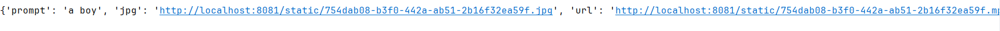
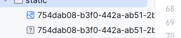

# AI接口大全

[中文](#jump1)
[English](#jump2)


## <span id="jump1">中文文档</span>


### PIKA接口

环境为python3.x，依赖版本适配python3即可

> 项目目录

```markdown
│  api.py             //对外接口，项目启动器
│  cookie.txt				     //你的账号cookie
│  generate.py				    //发送视频生成请求
│  authorization.txt  //账号token
└─static					         //下载后的视频存储
```


> 部署

- 先将本项目pika下载到本地
- 在cookie.txt填写你的账号的cookie，在authorization.txt填写token
- 到api.py下发送请求

 

>参生后的数据为一个falsk本地请求连接用于访问，自己部署falsk项目，端口为8081

 

>本地存储在static目录下

 
###  ChatGPT接口

环境为python3.7以上，依赖版本适配python3.7以上即可

> 部署

- 先将本项目chatgpt下载到本地
- 在cookie.txt填写你的账号的cookie，在authorization.txt填写token
- 到api.py下发送请求，此项目为flask项目

```python
@app.route('/createId',methods=['GET'])
def createId():
    conversation_id = make_new_conversation_id()
    return jsonify({'id': conversation_id})
```

这个是新建一个会话，返回这个唯一标识id，后面的通话就是靠这个id标识，可以创建多个

<hr/>

```python
@app.route('/send', methods=['POST'])
def send():
    conversation_id = request.json.get('conversation_id')
    msg = request.json.get('msg')
    ws = sends(msg, conversation_id)
    return jsonify({'ws': ws})
```

这是发送消息，用前面返回的id获取，然后返回一个websocket的url通道用于接收消息，由于这个不是很稳定，所以每次前端接收一个url就要创建一个连接，接收完后断开连接，这个websocket通道没有被墙国内可接收，但是发送需要魔法


> 以下是前端代码，vue3为例

- 创建新的会话id

```javascript
function frist_(){
     fetch('http://localhost:8081/createId').then(response => {
         return response.json();
     }).then(data => {
         console.log(data.id);    //返回的就是id
     })
 }
```

- 发送消息

```javascript
import base64 from 'base-64'; 
const fullMessage = ref([]);

//处理websocket所接收的信息，这个逻辑还得优化一下
function processMessage(message) {
    const bodyStartIndex = message.indexOf('"body": "') + '"body": "'.length;
    const bodyEndIndex = message.indexOf('", "more_body":');
    const bodyContent = message.substring(bodyStartIndex, bodyEndIndex);
    const decodedBody = base64.decode(bodyContent);
    fullMessage.value.push(decodedBody);
    if (decodedBody.includes('[DONE]')) {
        try {
            const parsedData = JSON.parse(fullMessage.value[fullMessage.value.length - 2].substring(6));
            const partsValue = parsedData.message.content.parts[0];
            console.log(partsValue);            //解析的message也就是chatgpt所返回的消息
            connectWebSocket.close()
        } catch (e) {
            console.log(e);
        }

    }
}


//连接websocket接收消息
const connectWebSocket = (ws) => {
    const websocket = new WebSocket(ws);

    websocket.onopen = () => {
        console.log('Connected to WebSocket server');
    };

    websocket.onmessage = (event) => {
        processMessage(event.data);
    };

    websocket.onerror = (error) => {
        console.error('WebSocket encountered error: ', error);
    };

    websocket.onclose = () => {
        console.log('WebSocket connection closed');
    };

    return websocket;
};
//发送消息
function sendMessage() {
     fetch('http://localhost:8081/send', {
         method: 'POST',
         headers: {
             'Content-Type': 'application/json'
         },
         body: JSON.stringify({ 'msg': ’发送的消息‘, 'conversation_id': ’frist_()所产生id' })
     }).then(response => {
         return response.json();
     }).then(data => {
         connectWebSocket(data.ws)         //接收wss_url然后创建websocket通道接收消息
     })
 }
```


***国内用户需要魔法代理***

> 有什么bug欢迎issues，或者加入本群930770787


## <span id="jump2">English Documentation</span>


### PIKA interface

The environment is python3.x, and the dependency version can be adapted to python3

> Project directory


```markdown
│  api.py           // External interface, project launcher
│  cookie.txt				  // Your account cookie
│  generate.py				 //Send a video generation request
│  authorization.txt  //Your account authorization
└─static					 //Video storage after download
```

> Deployment

- Download the pika of the project to your local computer
- Fill in the cookie of your account in the cookie.txt and the token in the authorization.txt
- Send the request under the test to the api.py

 

> the data after the birth is a FALSK local request connection for access, and you can deploy the FALSK project yourself , and port is 8081

 

> stored locally in the static directory


 
###  ChatGPT interface

The environment is Python 3.7 or later, and the version can be adapted to Python 3.7 or later

> Deployment

- Download the ChatGPT of this project to your local computer first
- Fill in the cookie of your account in the cookie.txt and the token in the authorization.txt
- Send a request to the api.py, which is a flask project
```python
@app.route('/createId',methods=['GET'])
def createId():
    conversation_id = make_new_conversation_id()
    return jsonify({'id': conversation_id})
```
This is to create a new session and return this unique identifier ID, and the subsequent calls can be identified by this ID, and multiple can be created

<hr/>

```python
@app.route('/send', methods=['POST'])
def send():
    conversation_id = request.json.get('conversation_id')
    msg = request.json.get('msg')
    ws = sends(msg, conversation_id)
    return jsonify({'ws': ws})
```

This is to send a message, get it with the id returned earlier, and then return a websocket URL channel for receiving messages, because this is not very stable, so every time the front-end receives a URL, it has to create a connection, and disconnect after receiving it

> Here's the front-end code, Vue3 as an example

- Create a new session ID

```javascript
function frist_(){
     fetch('http://localhost:8081/createId').then(response => {
         return response.json();
     }).then(data => {
         console.log(data.id);    //The returned is the ID
     })
 }
```

- Send messages

```javascript
import base64 from 'base-64'; 
const fullMessage = ref([]);

//To handle the information received by the websocket, this logic needs to be //optimized
function processMessage(message) {
    const bodyStartIndex = message.indexOf('"body": "') + '"body": "'.length;
    const bodyEndIndex = message.indexOf('", "more_body":');
    const bodyContent = message.substring(bodyStartIndex, bodyEndIndex);
    const decodedBody = base64.decode(bodyContent);
    fullMessage.value.push(decodedBody);
    if (decodedBody.includes('[DONE]')) {
        try {
            const parsedData = JSON.parse(fullMessage.value[fullMessage.value.length - 2].substring(6));
            const partsValue = parsedData.message.content.parts[0];
            console.log(partsValue);            //The parsed message is the message returned by ChatGPT
            connectWebSocket.close()
        } catch (e) {
            console.log(e);
        }

    }
}


//Connect to a websocket to receive messages
const connectWebSocket = (ws) => {
    const websocket = new WebSocket(ws);

    websocket.onopen = () => {
        console.log('Connected to WebSocket server');
    };

    websocket.onmessage = (event) => {
        processMessage(event.data);
    };

    websocket.onerror = (error) => {
        console.error('WebSocket encountered error: ', error);
    };

    websocket.onclose = () => {
        console.log('WebSocket connection closed');
    };

    return websocket;
};
//Send a message
function sendMessage() {
     fetch('http://localhost:8081/send', {
         method: 'POST',
         headers: {
             'Content-Type': 'application/json'
         },
         body: JSON.stringify({ 'msg': 'Send a message', 'conversation_id': 'the id' })
     }).then(response => {
         return response.json();
     }).then(data => {
         connectWebSocket(data.ws)         //Receive wss_url then create a websocket channel to receive messages
     })
 }
```
